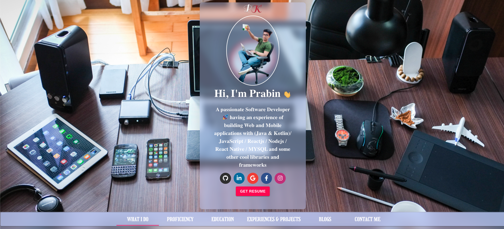
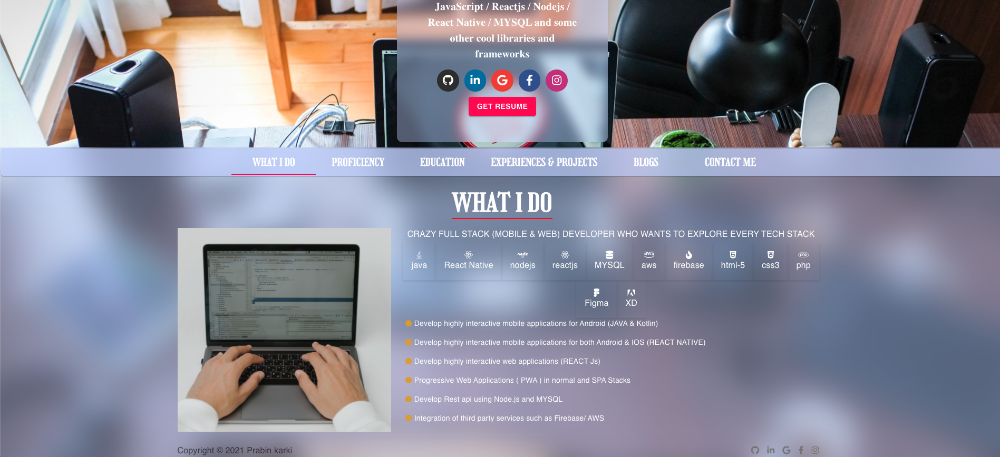

# Create Your developer portfolio in 5-10min with REACT JS

<h3>How to add my own data</h3>
<ul>
<li>Clone or download Zip of this repo</li>
<li>Open portfolio.data.js file located in /src/data/portfolio.data.js</li>
<li>Change / Override the details with your details</li>
<li>Run the code using npm start command, Boom your portfolio is ready 😮 </li>
</ul>

## Demo

[Demo Page](https://githubprabin143.github.io/developer_portfolio_maker 'Demo Page')